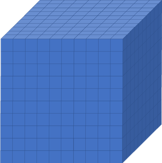

## What is HPC?

A HPC cluster is a collection of 'computers' called nodes, all inter connected. Considerably more powerful then just
one computer, like your laptop. As an idea of scaleJust for scale - your laptop typically has 8 cores. Kay has 40 cores
**per node** and has 336 **normal** compute nodes.

Once connected you can avail of the computation power and run scripts too heavy to run on your own computer. There are 
different types of nodes; 

- Login nodes
- Compute nodes
- High memory nodes
- GPU nodes

## Why would I need to use a HPC cluster?

The best way to answer this is with an example.

> ## Rationale for using a HPC
>
> Imagine you had a `10x10x10` box like the one below, divided up into smaller boxes,
> each measuring `1x1x1`. In one hour, one CPU core can simulate one hour of activity
> inside the smaller box. If you wanted to simulate what was happening inside the large
> box for 8 hours, be it a molecular interaction, climate, weather as an example, how long will
> it take to run if we only use one CPU core?
>
> 

>
> {: language-bash}
>
>> ## Solution
>>
>> 8000 hours...close to a year!
>>
>> This is way longer than is feasibly convenient! But remember, that is utilising just one
>> core. If you had a machine that could simulate each of those smaller boxes
>> simultaneously and a code that enables each box to effectively interact with each
>> other, the whole job would only take roughly an hour (but probably a little more because of
>> issues we will discuss in subsequent episodes).
>>
> {: .solution}
{: .challenge}

Although the techniques and exact methodologies of speedup like this is beyond the scope of this course, hopefully you
now realise and can imagine the types of things that a supercomputer can make possible through either the implementation
of high performance code or high quantities of cores.

## Login and compute nodes

Imagine the login and compute nodes as a catalog retailer like Argos. You enter into the shop, you are on the login
nodes. These are the initial entry points into a HPC system. You may well see a reflection of this in the prompt.

~~~
course00@login2:~$
~~~
{: .language-bash}

These **login nodes** can be considered the "foyer" of the HPC system, the external interface, you can browse the catalog of the HPC, 
i.e. check out the different libraries, use UNIX commands. But there is a problem with the login nodes, which is
everyone is using them. In the same way everyone enters a shop and explores, and the more crowded a shop is, the
slower things seem to happen.

If you decide to do work in this shop, for example by running code and utilising libraries, the more space you take up.
The shop's floor space is limited, and similarly, the login node space is limited. What can happen is that someone 
decides (wrongly) to run a long code in the login node, which takes up space and therefore everyone else is impacted
by it. You also get in trouble with systems!

Let's think about our example of Argos. The "foyer",
where you enter into the shop has an open space with a few desks. You may have a few little things like memory
sticks or a packet of mints that you can buy on the way to the till. 

But the most important feature are the catalogs on the desks, which have a list of all the items available. Next to it
you have some pencils and notepads where you write in the catalog number of the items(s) that you wish to purchase. You
then deliver your list of orders to the till and then an attendant gets the items for you behind the scenes while you
wait.

These can be thought of as the action of submission scripts and compute nodes. The **compute nodes** are like the
warehouse of the store, all the important things are stored there and is where all the major work is done. On a HPC, the
compute nodes are the place that your code is run.

The **submission scripts**, i.e. the list of orders in our shop, is sent to the compute node to undertake a task, where
all the work is done behind the scenes. There are ways to access the compute nodes directly, but that is beyond the
scope of this course

These compute nodes are controlled by a queueing system, and depending on the program submitted and the resources asked
for, you will be assigned a queue. The job will wait in the queue until the requested resources are available.

For this reason, the login nodes are only to be used for installing packages, moving files, and running **small** 
snippets of code, no longer than a few minutes. Just enough to check that your code is working properly

## ICHEC's national service

ICHEC's National Service provides three different project classes with differing resource allocations, review levels
and review turnaround times. The selection of each class largely depends on the necessities and requirements of the 
research and applicant's objectives.

You can use our [core calculator)](https://www.ichec.ie/academic/national-hpc/national-service-projects) to calculate
the number of core hours depending on the node type. If you are considering undertaking a project with ICHEC, this can
be a useful resource.

### Class C Project: Discovery

Class C projects are intended to provide fast access to modest resources with less review overhead. They have multiple
possible uses including:

- Introductory access for inexperienced HPC users
- Exploratory access for researchers who need to develop, port, optimise or benchmark codes
- Easier access for users planning small scale runs with very modest requirements

Class C project applicants should note that the maximum resource levels are modest and will be exhausted very quickly
if larger scale runs are performed.

|      Item     |                        Amount                             |
|---------------|-----------------------------------------------------------|
| Max. CPU      | 100,000 h                                                 |
| Max. Storage  | 250 GB                                                    |
| Max. Duration | 12 months                                                 |
| Max. Review   | 1 week                                                    |
| Proposal      | 2-3 pages.                                                |
| Applicants    | Group Leader/Professor/Lecturer/Post-doc/Graduate Student |

### Class B project: Regular

Class B projects are intended for the needs of the majority of the research community. Typically applicants will be
small research groups or individual researchers. Successful applications are expected to lead to referred publications.

|      Item     |                 Amount                    |
|---------------|-------------------------------------------|
| Max. CPU      | 1,000,000 h                               |
| Max. Storage  | 2000 GB                                   |
| Max. Duration | 18 months                                 |
| Max. Review   | 8 weeks                                   |
| Proposal      | 4-5 pages.                                |
| Applicants    | Group Leader/Professor/Lecturer/Post-doc  |

### Class A project: High Impact

Class A projects are intended for consortia concerned with high impact problems. These groups will require resources
representing a substantial fraction of the centre's resources over a long period of time. Successful applications are 
expected to yield high-impact scientific publications.

Class A project project applicants are expected to have a good knowledge of the characteristics of the code(s) which 
they intend to use - such as scalability properties - before writing their proposal. For this reason, applicants who 
are not in such a position are advised to first apply for an exploratory Class C project in order to undertake a basic 
scalability and performance study. Such an exercise is essential to provide an accurate estimate and a proper 
justification of the resources requested. 

|      Item     |                Amount               |
|---------------|-------------------------------------|
| Max. CPU      | 10,000,000 h                        |
| Max. Storage  | 5000 GB                             |
| Max. Duration | 24 months                           |
| Max. Review   | 12 weeks                            |
| Proposal      | 6-10 pages.                         |
| Applicants    | Group Leader/Professor/Lecturer/    |


