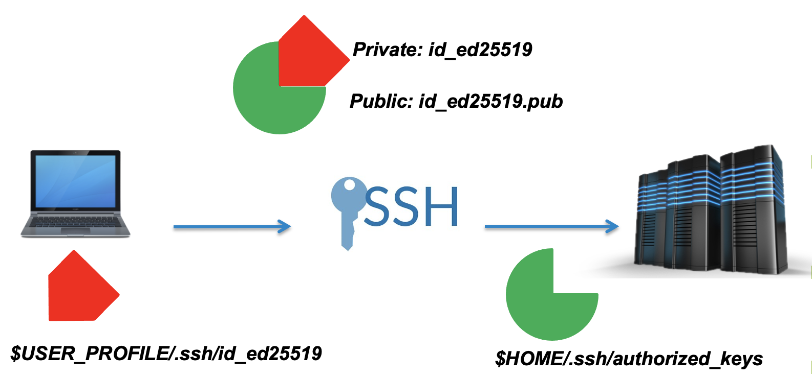

## SSH keys

If you have taken our Introduction to Linux course, you will already be familiar with SSH keys through the 
[SSH key episode](https://ichec-learn.github.io/intro-to-linux/07-ssh/index.html). If you have not, then here is a 
quick overview.

SSH, also known as the Secure Shell or Secure Socket SHell is a network protocol that gives users, and in particular
system administrators a secure way to access a computer over an unsecured network. Most of the worlds supercomputers,
or clusters require the use of an SSH key to gain access

When you set up an SSH key, you generate a “key-pair”, a public and private key. These will be stored in your home
directory.

See [here](https://www.ichec.ie/academic/national-hpc/documentation/tutorials/setting-ssh-keys) for a recap

> ## For Windows MobaXterm users
>
> MobaXterm will not automatically generate a public key in the correct directory, you will need to do 2 steps to get
> your public key working effectively.
>
> 1. In Settings Tab --> Terminal Tab --> Terminal features Box, ensure that the **Paste using right-click** box is
>    left un-ticked.
> 2. In Settings Tab --> General Tab --> Persistent home directory Box Enter `_ProfileDir_`  into the box, otherwise 
>    your public ssh key will be denied by ICHEC systems.
>
{: .callout}

The public key, in cryptographic terms is a large numerical value that is used to encrypt data. Most people don’t need 
to worry about it, however it is important to know what is looks like when printed to the screen. Public keys will 
have the extension .pub.

The private key, which is generated alongside the public key must stay on your local machine and not shared with 
anyone. These are used to decrypt messages that were created with the corresponding public key or to create signatures.

In other words, a public key locks up data from unauthorised use, while a private key is used to unlock it. The
machines perform a virtual handshake.

> ## A note on private keys
>
> Private keys are your private identity on an HPC system.
> 
> A private key that is visible to anyone but you should be considered compromised, and must be destroyed. This includes 
> having improper permissions on the directory it (or a copy) is stored in, traversing any network in the clear,
> attachment on unencrypted email, and even displaying the key (which is ASCII text) in your terminal window.
> 
> Protect this key as if it unlocks your front door. In many ways, it does.
>
{: .callout}

> ## Logging into Kay (15 minutes)
>
> You will have been sent a link to submit your ssh keys in the last few days, if you have not submitted your ssh key
> you must do so now.
>
> If you have sent your public key in, your ssh key will have been added to your course account. You should **ONLY USE**
> **YOUR COURSE ACCOUNT FOR THE DURATION OF THIS COURSE, REGARDLESS IF YOU ALREADY HAVE AN ACCOUNT WITH US**.
>
> Try and log in using the following command. Replace the XX with the course account nthat you have been given
> 
> ~~~
> ssh courseXX@kay.ichec.ie
> ~~~
> {: .language-bash}
> 
> You will be asked for a passphrase for your public ssh key. This passphrase is out of ICHEC's control and only you
> should know this passphrase, having generated it yourself. It will look similar to below, as it is searching for the
> location of your public key in your home directory.
>
> ~~~
> Enter passphrase for key '/Users/johnsmith/.ssh/id_ed25519':
> ~~~
> {: .output}
>
> Next will be the password provided for this course. If you are accessing this material outside of a course, this will
> be your password associated with your account.
>
> ~~~
> course00@kay.ichec.ie's password:
> ~~~
> {: .output}
>
> Once you get the following output, you have successfully logged in.
>
> ~~~
> #############################################################################
> #      _  __      __     _______ _____ _    _ ______ _____   _____ ______ 
> #     | |/ /    /\\ \   / /_   _/ ____| |  | |  ____/ ____| |_   _|  ____|
> #     | ' /    /  \\ \_/ /  | || |    | |__| | |__ | |        | | | |__   
> #     |  <    / /\ \\   /   | || |    |  __  |  __|| |        | | |  __|  
> #     | . \  / ____ \| | _ _| || |____| |  | | |___| |____ _ _| |_| |____ 
> #     |_|\_\/_/    \_\_|(_)_____\_____|_|  |_|______\_____(_)_____|______|
> #                                                                          
> #############################################################################
> # 
> # You have been successfully logged in to the Kay National HPC System
> #
> # Documentation: https://www.ichec.ie/academic/national-hpc/kay-documentation
> #
> # For technical support, email support@ichec.ie
> # 
> ##############################################################################
> ~~~
> {: .output}
> 
> If you finish this exercise quickly, feel free to have a look at the Linux commands below and get some practice
> while you wait.
>
{: .challenge}

> ## Clone the lesson repository
>
> In your current working directory, which should be similar to `course00/home/`, type the following command:
>
> ~~~
> git clone https://github.com/ICHEC-learn/intro-to-hpc.git 
> ~~~
> {: .language-bash}
> 
> This will clone the lesson's repository into your current directory, and you have access to all the lecture material
> including slides, exercises and markdown files. You can download this material later when we use the `scp` command.
>
{: .challenge}

## A review of the Linux commands

If you are new to Linux, then we highly recommend that you go through the materials covered in our 
[Introduction to Linux](https://ichec-learn.github.io/intro-to-linux/) course before continuing. A brief summary of the
most commonly used commands are given below.

#### `pwd` - print working directory

This is a very simple command which shows you where you are in the directory tree.

~~~
$ pwd
~~~
{: .language-bash}

~~~
/ichec/home/users/course00
~~~
{: .output}

#### `ls` - list

Lists out all the files and directories in your current working directory. This command has a few extra flag options. 
Flags need to be accompanied with a `-` before it

~~~
$ ls -l
~~~
{: .language-bash}

| Flag |          Operation          |
|------|-----------------------------|
| `a`  | show hidden files           |
| `t`  | sort by modification time   |
| `l`  | long, detailed list         |
| `d`  | express directory as a file |
| `h`  | human readable              |

#### `cd` - change directory

Probably the most commonly used command, used to change directories. 

|     Action     |          Operation         |
|----------------|----------------------------|
|    `cd dir`    | Move into `dir` directory  |
|    `cd ..`     | Move back 1 directory      |
|  `cd ../../`   | Move back 2 directories    |
| `cd` or `cd ~` | Move to home directory     |
|     `cd -`     | Move to previous directory |

#### `mkdir` and `rmdir` - make directory and remove directory

The command `mkdir` creates a new empty directory, and `rmdir` can remove an empty directory.

~~~
$ mkdir new_directory
$ rmdir new_directory
~~~
{: .language-bash}

#### `mv` and `cp` - move and copy

Move `mv` and copy `cp` work in very similar ways, where two inputs are needed, first the file that you are 
copying/moving and second the location you are moving/copying to. The `mv` command has a secondary use to 
rename a file.

~~~
$ mv file1 renamed_file1
$ mv file1 mydir
$ cp file1 mydir
~~~
{: .language-bash}

#### `rm` - remove

The remove command `rm` is a particularly dangerous command, as the shell deletes files instantly, bypassing the regular
recycle bin.

| Flag |                     Operation                     |
|------|---------------------------------------------------|
| `r`  | Recursive, removes directory and all files within |
| `f`  | Force, no prompt                                  |
| `i`  | Prompts before removing file                      |

It is recommended to use `rm` with the `-i` flag at first

~~~
$ rm myfile.txt
~~~
{: .language-bash}

#### `man` and `--help`- manual and help

The manual, `man` command displays a user manual of any command, including the different flag options associated with
that command.

~~~
$ man ls
~~~
{: .language-bash}

The `--help` command serves a similar purpose to `man`, with a different implementation.

#### `history` - last commands typed

History is a helpful command which by default shows the last 1000 commands used. It can sometimes be helpful to pipe it
to `less` using `|`.

~~~
$ history
~~~
{: .language-bash}

#### `grep` - search

The search command, grep stands for **globally search for a regular expression**, and is one of the more powerful
commands in UNIX, particularly when used with pipes.

~~~
grep 'expression' file.txt
~~~
{: .language-bash}

#### `vim` and `nano` - text editors

The programs `vim` and `nano` are text editors that can be used on most HPC clusters. We will work with these more in
upcoming episodes. We would recommend using `vim` as it has plentiful useful shortcuts and is very versatile. It can be
tricky to learn, so feel free to use `nano` for an easy use file editor.

~~~
$ vim myfile.txt 
$ nano myfile.txt 
~~~
{: .language-bash}

This will be covered in more detail in the [next episode](03-moving-and-editing.md).


